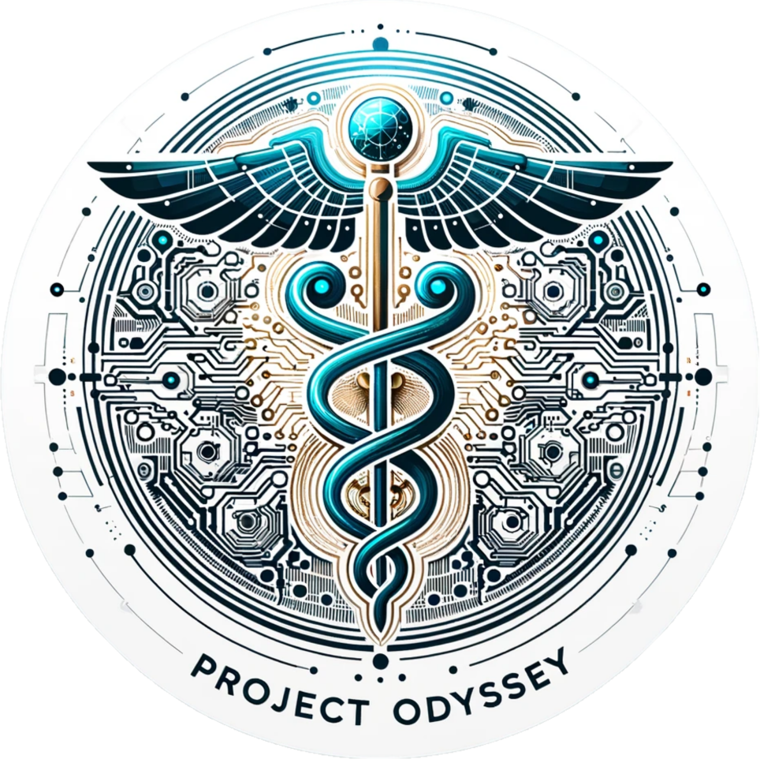
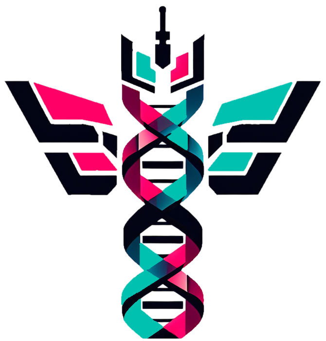
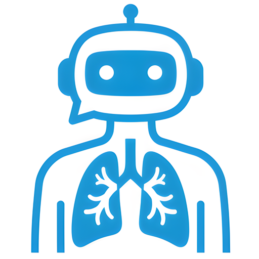

<h1 align="center"> 🌸 Hello, I'm Adib! 🍁</h1>

  
  
  
  
  

  <strong> 🤖 Machine Learning Engineer &nbsp; | &nbsp; 🧠 Neuroscientist &nbsp; | &nbsp; 🌐 Community Builder</strong>

  Machine Learning at Vector Institute and University Health Network, Computer Science and Neuroscience student at the University of Toronto, ambitious to push the boundaries of developing Artificial Intelligence and understanding Biological Intelligence.

---
 

## 🚀 Featured Research

  <table>
    <tr>
      <td width="33%" valign="top">
        

          
        

        <h3 align="center"><strong>EHRMamba</strong></h3>
        

          
          
          
        

        

          Developed a state-of-the-art foundation model for Electronic Health Records, and Odyssey, the largest open-source library for full-stack EHR modeling.
        

      </td>
      <td width="33%" valign="top">
        

          
        

        <h3 align="center"><strong>CodonTransformer</strong></h3>
        

          
          
          
        

        

          Engineered a state-of-the-art model to optimize DNA sequences for protein expreesion in 164 organisms, and released the largest toolkit for codon optimization.
        

      </td>
      <td width="33%" valign="top">
        

          
        

        <h3 align="center"><strong>MedRAX</strong></h3>
        

          
          
          
        

        

          Built the world's most advanced medical reasoning agent for chest x-ray interpretation, outperforming general purpose and medical trained models.
        

      </td>
    </tr>
  </table>

 

## 💼 Experience

### 🩺 Health AI
- **University Health Network (WangLab)**: Building medical reasoning agents for chest X-ray (Sep 2024 - Present)
- **Vector Institute**: Developing multimodal medical LLMs and EHR foundation models (Jan 2024 - December 2024)
- **Broad Institute of MIT and Harvard**: Researching safety and privacy of healthcare models (Aug 2024 - February 2024)
- **Mayo Clinic**: Detecting cancer using contrastive learning of pathology & radiology images (Jul 2024 - October 2024)
- **BorealisAI**: Generating radiology reports with medical language models (Mar 2024 - Aug 2024)

### 🧬 Computational Biology & Neuroscience
- **Vector Institute, UHN**: Building biological reasoning models and state-of-the-art DNA foundation models (January 2025 - Present)
- **INSERM, France**: Optimizing DNA sequences for protein expression (Jul 2023 - Sep 2024)
- **XAtoms - AI Lead**: Developing novel photocatalytic structures to clean water (Oct 2024 - Present)
- **iGEM Toronto**: Generating novel plasmids with antibacterial properties (Mar 2024 - October 2024)
- **UofT Machine Intelligence Team**: Predicting protein function with AI, won 2nd prize in CUCAI 2024 (Aug 2023 - Jul 2024)
- **UofT Filion & Koyama Lab**: Translating zebrafish brain activity to body movements (May 2023 - August 2023)

### 🚀 Leadership & Initiatives
- **GenAI Genesis**: Organizing Canada's largest AI hackathon as founder & co-chair (Sep 2023 - Present)
- **Google Developer Student Club**: Leading GDSC @ UTSC (Aug 2023 - Present)
- **International Biology Olympiad**: Silver Medalist (2021)

 

## 🛠 Tech Stack

  
  
  
  
  
  
  
  
  
  
  
  
  
  
  
  
  
  
  
  
  

 

## 📊 GitHub Stats

  
  &nbsp; &nbsp;
  

 
