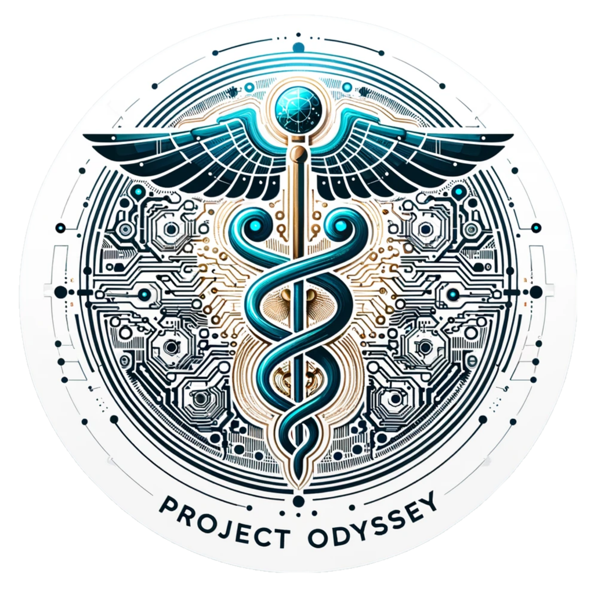

<h1 align="center"> 🌸 Hello, I'm Adib! 🍁</h1>

  
  
  
  
  

  <strong> 🤖 Machine Learning Engineer &nbsp; | &nbsp; 🧠 Neuroscientist &nbsp; | &nbsp; 🌐 Community Builder</strong>

  Machine Learning at Vector Institute and University Health Network, Computer Science and Neuroscience student at the University of Toronto, ambitious to push the boundaries of developing Artificial and understanding Biological Intelligence.

---
 

## 🚀 Featured Projects

  <table>
    <tr>
      <td width="50%" valign="top">
        

          
        

        <h3 align="center"><strong>EHRMamba</strong></h3>
        

          
          
        

        

          <strong>Paper:</strong> NeurIPS ML4H 2024 (U/R) 
          Vector Institute, University of Toronto
        

        

          State-of-the-art foundation model for Electronic Health Records. Part of Odyssey, the largest open-source library for full-stack EHR modeling.
        

      </td>
      <td width="50%" valign="top">
        

          
        

        <h3 align="center"><strong>CodonTransformer</strong></h3>
        

          
          
        

        

          <strong>Paper:</strong> Nature Communications (U/R) 
          INSERM (France), University of Toronto
        

        

          State-of-the-art model for optimizing DNA sequences for protein expression in 164 organisms. Part of the largest open-source library for codon optimization.
        

      </td>
    </tr>
  </table>

 

## 💼 Experience

### 🩺 Healthcare AI
- **Applied Machine Learning Engineer** at Vector Institute (Jan 2024 - Present)
- **Machine Learning Engineer** at University Health Network (Sep 2024 - Present)
- **Machine Learning Researcher** at Broad Institute of MIT and Harvard (Aug 2024 - Present)
- **Machine Learning Researcher** at Mayo Clinic (Jul 2024 - Present)
- **Computer Vision Researcher** at BorealisAI (Mar 2024 - Aug 2024)

### 🧬 Computational Biology & Neuroscience
- **Machine Learning Researcher** at INSERM, France (Jul 2023 - Sep 2024)
- **Computational Biology Researcher** at iGEM Toronto (Mar 2024 - Present)
- **Machine Learning Developer** at UTMIST, 2nd prize in CUCAI 2024 (Aug 2023 - Jul 2024)
- **Computer Vision Researcher** at UofT Filion & Koyama Lab (May 2023 - Present)

### 🚀 Leadership & Initiatives
- **Founder & Lead** of Google Developer Student Club at UTSC (Aug 2023 - Present)
- **Founder & Co-Chair** of GenAI Genesis, Canada's largest AI hackathon (Sep 2023 - Present)
- **Silver Medal**, International Biology Olympiad (2021)

 

## 🛠 Tech Stack

  
  
  
  
  
  
  
  
  
  
  
  
  
  
  
  
  
  
  
  
  

 

## 📊 GitHub Stats

  
  &nbsp; &nbsp; &nbsp;
  

 
